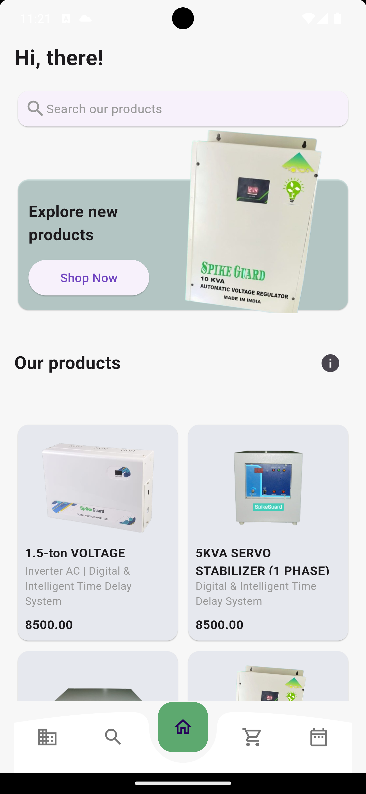
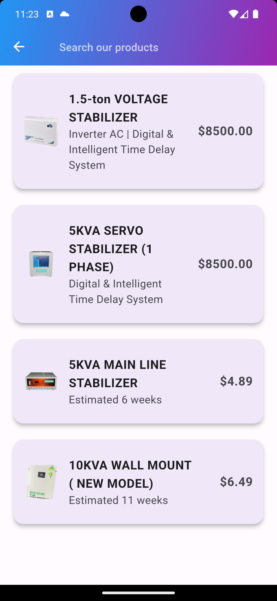
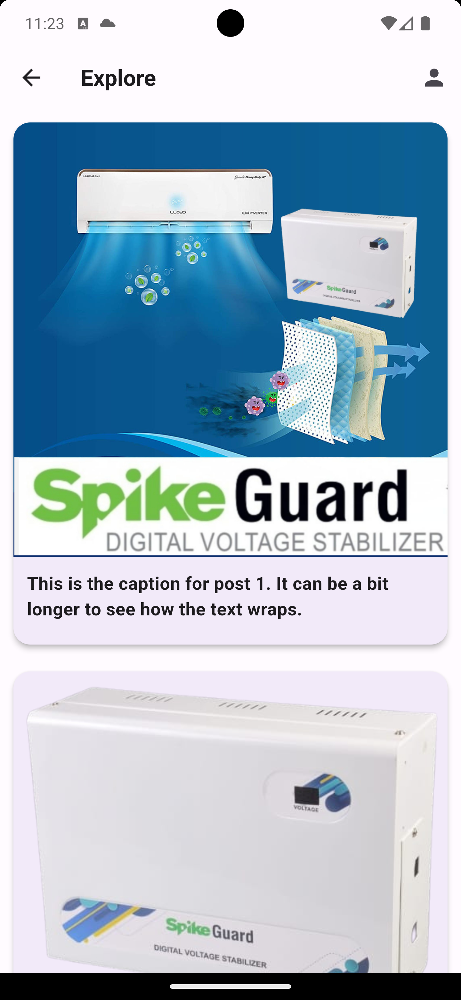
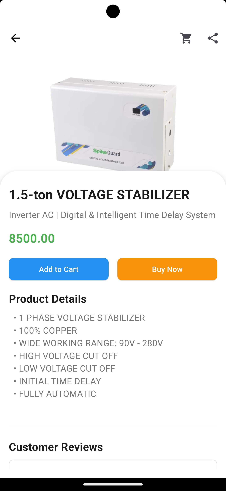
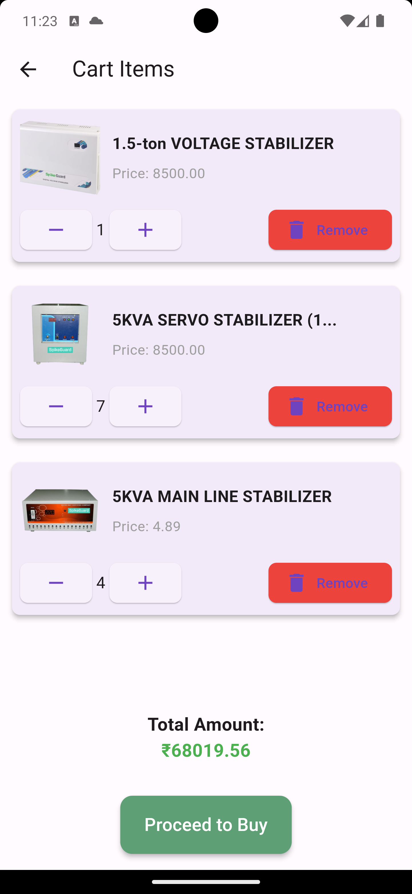
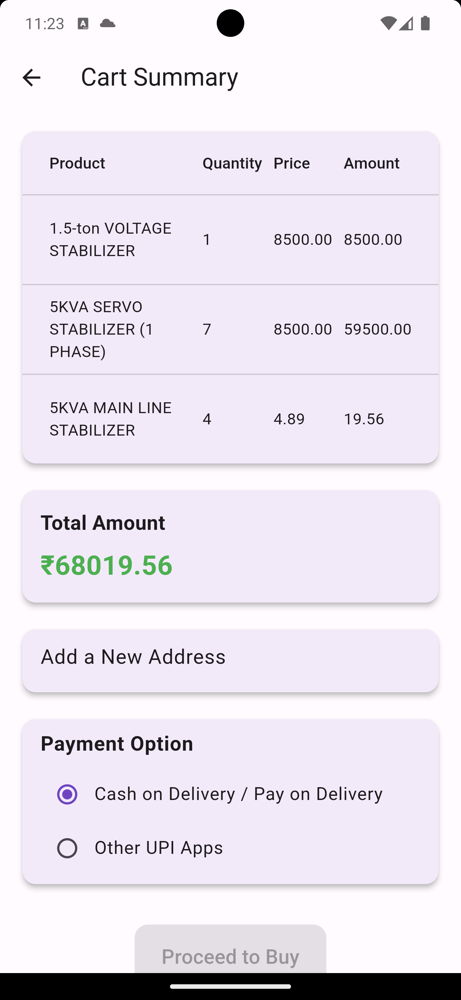
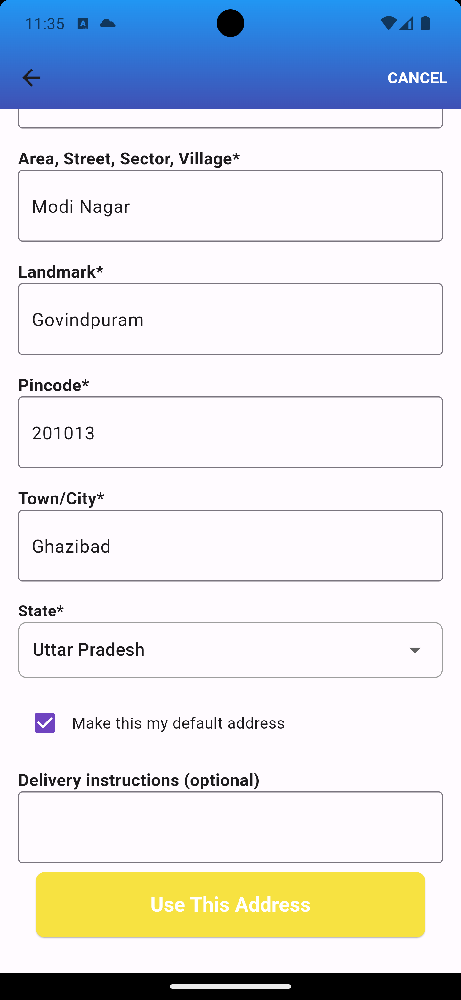
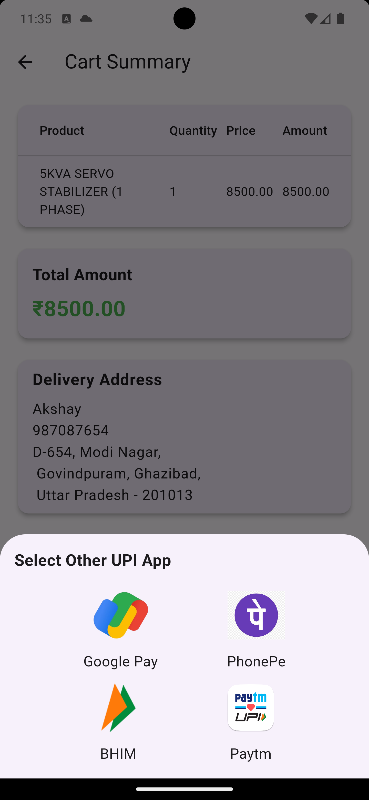
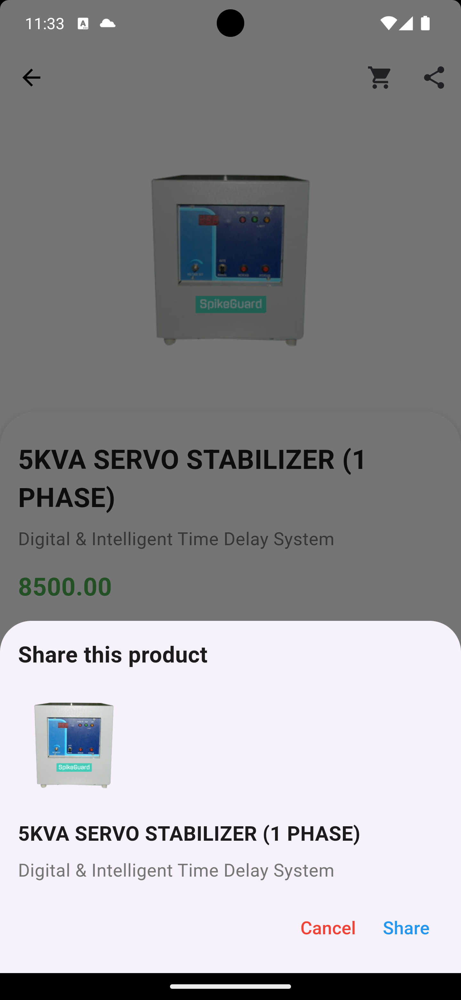
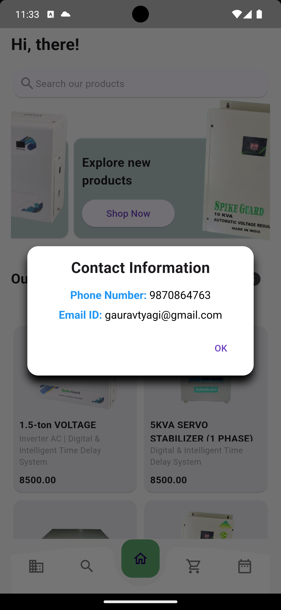

# SpikeGuard E-Commerce App

## Overview

Welcome to SpikeGuard, an innovative and user-friendly e-commerce app built using Flutter for the front end and Firebase for the backend. SpikeGuard is designed to provide a seamless shopping experience with advanced security features. This document serves as a comprehensive guide for developers and contributors to understand the project structure, setup, and key functionalities.

## Features

1. **Product Catalog:** A well-organized product catalog showcasing a variety of products.
2. **Shopping Cart:** Users can easily add, update, and remove items from their shopping cart.
3. **Order Management:** Users can view and manage their orders, including order history.
4. **Payment Integration:** Seamless payment processing with popular payment gateways.
5. **Search and Filters:** Advanced search and filter options to enhance user experience.
6. **User Reviews:** Customers can view reviews and ratings for products.
7. **Real-time Updates:** Utilizes Firebase Realtime Database for real-time updates on orders and product availability.

## Getting Started

### Prerequisites

- Ensure you have Flutter and Dart installed. Follow the [official Flutter installation guide](https://flutter.dev/docs/get-started/install) for instructions.

## Installation

1. **Clone the repository:**

   ```bash
   git clone https://github.com/kakshaytyagi/E-Commerce_Flutter_App


2. **Navigate to the project directory:**
   ```bash
    cd E-Commerce_Flutter_App

3. **Install dependencies:**
   ```bash
    flutter pub get


## Screenshots

###Main Screens || Search Screen || Explore

<div style="display: flex; justify-content: space-between;">
  
  
  
</div>

###Product Screen || Cart Screen || Checkout Screen
<div style="display: flex; justify-content: space-between;">
  
  
  
</div>

###Address || Payment Screen
<div style="display: flex; justify-content: space-between;">
  
  
</div>

###Shair Screen || Contant Screen || Author Screen
<div style="display: flex; justify-content: space-between;">
  
  
  
</div>


## Getting Started
1. Clone the repository
2. Open the project in Flutter IDE
3. Run the app on your preferred device or emulator

## Dependencies
- Flutter 2.0 or higher
- Dart 2.12 or higher

## Contributions
Contributions are welcome! If you encounter any issues or have suggestions for improvements, please feel free to open an issue or submit a pull request.

## License
This project is licensed under the developer. Feel free to use and modify the code as per your requirements.

## Acknowledgments
Special thanks to the Flutter community for their valuable resources and inspiration in creating this UI.

- [Lab: Write your first Flutter app](https://docs.flutter.dev/get-started/codelab)
- [Cookbook: Useful Flutter samples](https://docs.flutter.dev/cookbook)

For help getting started with Flutter development, view the
[online documentation](https://docs.flutter.dev/), which offers tutorials,
samples, guidance on mobile development, and a full API reference.


